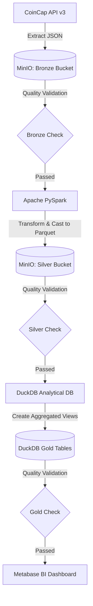
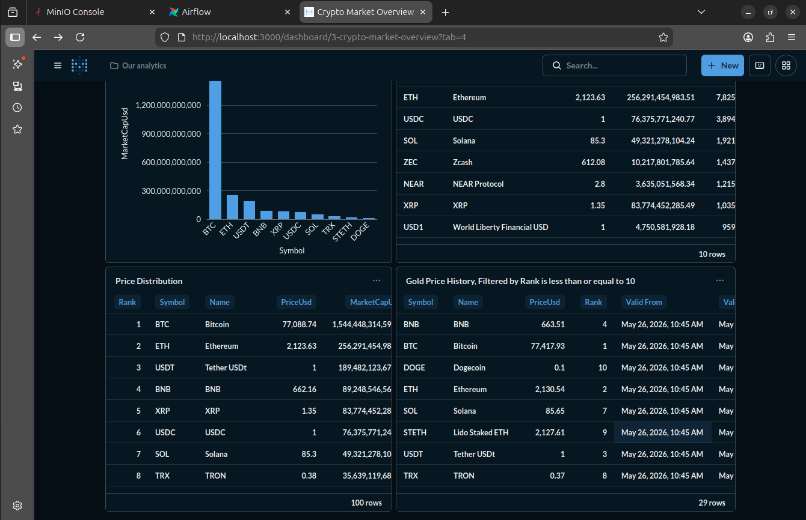

# 🚀 Crypto Data Lakehouse Pipeline

Welcome to the **Crypto Data Lakehouse Pipeline**! This is a production-ready modern data platform built using **Medallion Architecture (Bronze ➔ Silver ➔ Gold)** to extract, validate, transform, aggregate, and visualize real-time cryptocurrency assets.

The project is fully containerized and orchestrated locally using **Astronomer Apache Airflow**, leveraging **PySpark**, **MinIO (S3-compatible Object Storage)**, **DuckDB**, and **Metabase**.

---

## 🏗️ System Architecture

Our data platform implements a robust **Medallion Data Lakehouse** workflow:



### 📊 Metabase BI Dashboard


---

## 🛠️ Core Technology Stack

* **Orchestration:** [Apache Airflow (Astronomer)](https://airflow.apache.org/) - Manages pipeline execution DAGs, dependencies, and retries.
* **Storage (Data Lake):** [MinIO](https://min.io/) - S3-compatible Object Storage hosting raw Bronze JSONs and transformed Silver Parquet tables.
* **Processing:** [Apache PySpark (Spark 3.5)](https://spark.apache.org/) - High-performance distributed schema transformation, type casting, and data cleanup.
* **Analytical Warehouse:** [DuckDB](https://duckdb.org/) - Lightning-fast in-process SQL OLAP database for Gold layer aggregations.
* **Visualization (BI):** [Metabase](https://www.metabase.com/) - Modern dashboard interface connecting to DuckDB via a custom-patched high-performance JDBC driver.

---

## 📂 Project Directory Structure

```text
├── dags/
│   └── crypto_pipeline.py       # Core Airflow DAG orchestrating ETL and checks
├── docs/
│   └── assets/
│       └── crypto-visual.png    # Metabase visual showcase image
├── include/
│   ├── metabase/
│   │   └── plugins/             # Patched DuckDB/MotherDuck JDBC Metabase driver
│   ├── scripts/
│   │   ├── db.py                # Centralized database and storage connector
│   │   ├── extract.py           # Ingestion script: API to MinIO Bronze
│   │   ├── transform.py         # PySpark processing script: Bronze to Silver Parquet
│   │   ├── load.py              # OLAP script: Silver Parquet to DuckDB Gold tables
│   │   └── quality_checks.py    # Medallion data validation tests
│   └── warehouse/               # Local volume hosting H2 app db and DuckDB analytical files
├── tests/                       # Pytest integration, transform, and extraction test files
├── docker-compose.override.yml  # Local overrides for Spark, MinIO, and Metabase
├── Dockerfile.metabase          # Custom Debian JRE image resolving DuckDB JNI libraries
├── requirements.txt             # Project Python dependencies
└── README.md                    # Project blueprint and technical reference
```

---

## ⚡ Data Pipeline Tasks

1. **`extract_assets`:** Calls the CoinCap API v3, pulls cryptocurrency asset data, and uploads the raw JSON payload to the S3-compatible `bronze` MinIO bucket under path `assets/YYYY-MM-DD/assets.json`.
2. **`check_bronze_quality`:** Asserts the JSON has at least 10 records and essential columns (`id`, `priceUsd`) are present in a sample.
3. **`transform_assets`:** Spins up a localized **PySpark session**, reads the Bronze JSON, flattens the nested structure, casts fields to proper numeric types (`DoubleType`, `LongType`), drops null records, and writes optimized, compressed Parquet files to the `silver` bucket under `assets/YYYY-MM-DD/`.
4. **`check_silver_quality`:** Runs DuckDB queries on Silver Parquet files directly inside MinIO via `httpfs` to assert row count thresholds and zero null values.
5. **`load_gold_tables`:** Materializes analytical Gold tables (`gold_asset_rankings`, `gold_market_summary`, `gold_price_aggregations`) and processes slowly-changing data in **`gold_price_history`** via transaction-aware **SCD Type 2**.
6. **`check_gold_quality`:** Verifies all Gold tables exist in DuckDB and are successfully populated with records.

---

## 🔄 Slowly Changing Dimensions (SCD Type 2) in Gold Layer

To support historical trend analysis, the pipeline implements **Slowly Changing Dimensions (SCD Type 2)** tracking on asset price and rank history inside the `gold_price_history` table:

* **Active Records:** Active records representing the latest state have their `is_current` attribute set to `true` and `valid_to` set to `NULL`.
* **State Drift & Versioning:** When an asset's price or rank changes compared to the active record in the database, the pipeline gracefully expires the old active record by setting `is_current = false` and `valid_to = now()`, and inserts a fresh active version containing the new pricing data with `valid_from = now()`.
* **Atomic staging-and-swap update pattern:** To prevent DuckDB file locks and ensure complete concurrency safety with Metabase dashboard readers:
  1. The pipeline copies the active production DuckDB to a temporary `crypto_staging.duckdb` file.
  2. All transformations, SCD merges, and view creation are performed inside the staging environment.
  3. Upon a successful transaction, it executes an atomic file-system swap (`os.replace`) to replace the production database.

---

## 🚀 How to Run Locally

### 1. Prerequisite
Ensure you have [Docker Desktop](https://www.docker.com/products/docker-desktop/) and the [Astronomer CLI](https://www.astronomer.io/docs/astro/cli/install-cli) installed on your system.

### 2. Start the Platform
Initialize and spin up all Airflow, Spark, MinIO, and Metabase services by running:
```bash
astro dev start
```

### 3. Open UI Services
Once up and running, you can access the following dashboards:

* ✈️ **Airflow UI:** `http://localhost:8080/` (Default credentials: `admin:admin`)
* 🗄️ **MinIO Console:** `http://localhost:9001/` (Default credentials: `minioadmin:minioadmin`)
* 📊 **Metabase UI:** `http://localhost:3000/` (Your original account data is mapped)

---

## 🧪 Testing and Quality Control

The project includes a robust **pytest** suite to validate integrations, schema models, and DAG properties. 

To execute the test suite inside the running Airflow context, run:
```bash
docker exec -t crypto-pipeline_4e4163-scheduler-1 pytest
```

### Best Practices Applied
* **Centralized Connections:** Shared boto3 and DuckDB configurations are encapsulated in `db.py`, eliminating duplicate connection boilerplate.

* **DAG Tagging & Retries:** Core DAGs enforce mandatory tag setups and require a task retry factor of at least `2` to ensure production robustness.
